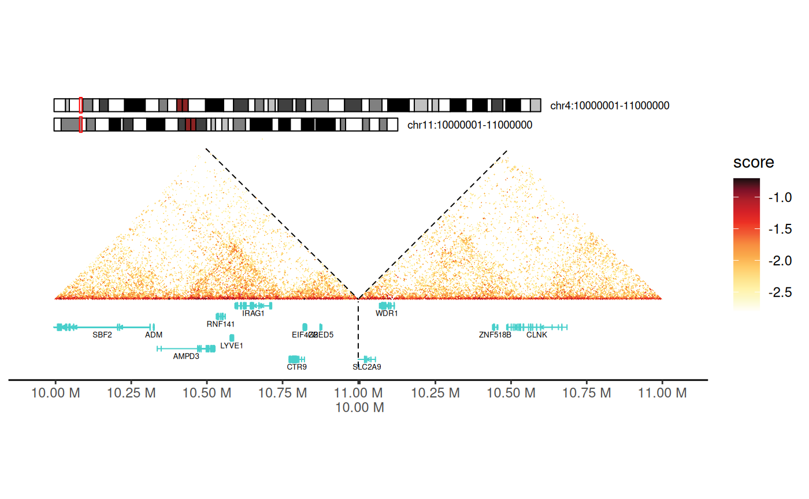

# Visualizing 3D Genome Organization with gghic

## Introduction

**gghic** is an R package for creating publication-ready visualizations
of 3D genome organization data. It seamlessly integrates Hi-C contact
maps, topologically associating domains (TADs), chromatin loops, gene
annotations, and genomic tracks into unified, customizable plots.

### Why gghic?

- **Easy to use**: Simple, intuitive syntax with sensible defaults for
  quick plotting
- **Flexible**: Choose between high-level
  [`gghic()`](https://jasonwong-lab.github.io/gghic/reference/gghic.md)
  wrapper or low-level `geom_*` layers for fine control
- **Memory efficient**: Smart `focus` mechanism loads only the genomic
  regions you need
- **Publication-ready**: High-quality figures with minimal code
- **Extensible**: Built on `ggplot2` ecosystem—use standard `ggplot2`
  functions for customization

### Key Features

- **`ChromatinContacts` S4 class**: Robust object-oriented framework for
  managing Hi-C/-like data
- **Flexible focusing**: Efficiently subset genomic regions before or
  after loading data
- **Feature integration**: Seamlessly combine TADs, loops, genes, and
  signal tracks
- **Multiple visualization modes**: Single chromosome, multi-chromosome,
  inter-chromosomal, and multi-way contacts
- **Hypergraph analysis**: Specialized tools for visualizing
  Pore-C/-like multi-way chromatin interactions

> **Resources:**
>
> - [arXiv preprint](https://arxiv.org/abs/2412.03005)
> - [GitHub repository](https://github.com/mhjiang97/gghic)
> - [Depth by resolution
>   vignette](https://jasonwong-lab.github.io/gghic/articles/depth.md)
>   for Hi-C/-like data quality assessment
> - [Hypergraph
>   vignette](https://jasonwong-lab.github.io/gghic/articles/hypergraph.md)
>   for Pore-C/-like multi-way contact analysis

### Typical Workflow

1.  **Load data**: Create `ChromatinContacts` object from Cooler files
2.  **Focus**: Specify genomic regions of interest (optional but
    recommended)
3.  **Import**: Load interaction data into memory
4.  **Add features**: Attach TADs, loops, genes, and tracks (optional)
5.  **Visualize**: Use
    [`gghic()`](https://jasonwong-lab.github.io/gghic/reference/gghic.md)
    wrapper or custom `ggplot2` layers
6.  **Customize**: Refine with standard `ggplot2` functions and themes

------------------------------------------------------------------------

## Getting Started

### Load Required Packages

``` r
load_pkg <- function(pkgs) {
  for (pkg in pkgs) suppressMessages(require(pkg, character.only = TRUE))
}

load_pkg(
  c("ggplot2", "dplyr", "GenomicRanges", "InteractionSet", "gghic")
)
```

### Download Example data

The example data files are hosted on the
[gghic-data](https://github.com/mhjiang97/gghic-data) repository. This
function downloads files to a local cache:

``` r
download_example_files <- function(cache_dir, check_exists = TRUE) {
  if (!dir.exists(cache_dir)) dir.create(cache_dir, recursive = TRUE)

  files <- list(
    "chr4_11-100kb.cool" = "cooler/chr4_11-100kb.cool",
    "chr4_11-5kb.cool" = "cooler/chr4_11-5kb.cool",
    "track1.bigWig" = "bigwig/track1.bigWig",
    "track2.bigWig" = "bigwig/track2.bigWig",
    "gencode-chr4_11.gtf.gz" = "gtf/gencode-chr4_11.gtf.gz",
    "TADs_500kb-chr4_11.tsv" = "tad/TADs_500kb-chr4_11.tsv",
    "loops-chr4_11.txt" = "loop/loops-chr4_11.txt",
    "gis_hic.rds" = "multiway/gis_hic.rds",
    "concatemers.rds" = "multiway/concatemers.rds"
  )

  url_base <- "https://raw.githubusercontent.com/mhjiang97/gghic-data/master/"

  for (file_name in names(files)) {
    file_path <- file.path(cache_dir, file_name)
    if (check_exists && file.exists(file_path)) next
    message("Downloading ", file_name, "...")
    download.file(
      paste0(url_base, files[[file_name]]), file_path,
      method = "curl", quiet = TRUE
    )
  }
}
```

``` r
# Define a cache directory and download the files
dir_cache <- file.path("..", "data")
download_example_files(dir_cache)

# Set up paths to the downloaded files
path_cf_100 <- file.path(dir_cache, "chr4_11-100kb.cool")
path_cf_5 <- file.path(dir_cache, "chr4_11-5kb.cool")
path_gtf <- file.path(dir_cache, "gencode-chr4_11.gtf.gz")
paths_track <- file.path(dir_cache, paste0("track", 1:2, ".bigWig"))
path_tad <- file.path(dir_cache, "TADs_500kb-chr4_11.tsv")
path_loop <- file.path(dir_cache, "loops-chr4_11.txt")
path_gis_hic <- file.path(dir_cache, "gis_hic.rds")
path_concatemers <- file.path(dir_cache, "concatemers.rds")
```

## Working with ChromatinContacts Objects

### Understanding ChromatinContacts

The `ChromatinContacts` object is the central data structure in `gghic`.
It acts as a lightweight pointer to your Hi-C data (Cooler files),
storing resolution and sequence information without loading the massive
interaction matrix into memory immediately.

A key feature is the `focus` argument. This allows you to specify
chromosomes or regions of interest *before* importing the data.

**Why use focus?**

1.  **Speed**: Only reads relevant parts of the Hi-C matrix.
2.  **Memory Efficiency**: Prevents loading genome-wide matrices when
    you only need a specific locus.

### Creating ChromatinContacts Objects

#### No Focus (Genome-Wide)

Without a `focus`, the object references the entire genome:

``` r
cc_100_all <- ChromatinContacts(cooler_path = path_cf_100)
cc_100_all
#> ChromatinContacts object
#> --------------------------------------------------
#> File: chr4_11-100kb.cool
#> Sequences: 2 (chr11, chr4)
#> Focus: genome-wide
#> Interactions: not loaded (use import() to load)
#> --------------------------------------------------
```

#### Focusing on Specific Regions

The `focus` argument accepts flexible region specifications. This is the
**recommended approach** for working with large Hi-C datasets.

##### Single Region or Chromosome

``` r
# Focus on entire chromosome (includes all intra-chromosomal interactions)
cc_chr11 <- ChromatinContacts(cooler_path = path_cf_100, focus = "chr11")
cc_chr11
#> ChromatinContacts object
#> --------------------------------------------------
#> File: chr4_11-100kb.cool
#> Sequences: 2 (chr11, chr4)
#> Focus: 1 region
#>   [1] chr11:1:135,006,516 <-> chr11:1:135,006,516
#> Interactions: not loaded (use import() to load)
#> --------------------------------------------------
```

``` r
# Focus on specific 10 Mb region
cc_chr11_region <- ChromatinContacts(
  cooler_path = path_cf_100, focus = "chr11:60000000-70000000"
)
cc_chr11_region
#> ChromatinContacts object
#> --------------------------------------------------
#> File: chr4_11-100kb.cool
#> Sequences: 2 (chr11, chr4)
#> Focus: 1 region
#>   [1] chr11:60,000,000:70,000,000 <-> chr11:60,000,000:70,000,000
#> Interactions: not loaded (use import() to load)
#> --------------------------------------------------
```

##### Multiple Regions with Operators

Use `|` (OR) for multiple regions and `&` (AND) for inter-regional
interactions:

``` r
# Multiple chromosomes
# Returns: chr4-chr4, chr11-chr11, AND chr4-chr11 interactions
cc_multi <- ChromatinContacts(
  cooler_path = path_cf_100, focus = "chr4 | chr11"
)
cc_multi
#> ChromatinContacts object
#> --------------------------------------------------
#> File: chr4_11-100kb.cool
#> Sequences: 2 (chr11, chr4)
#> Focus: 3 regions
#>   [1] chr11:1:135,006,516 <-> chr11:1:135,006,516
#>   [2] chr11:1:135,006,516 <-> chr4:1:191,154,276
#>   [3] chr4:1:191,154,276 <-> chr4:1:191,154,276
#> Interactions: not loaded (use import() to load)
#> --------------------------------------------------
```

``` r
# Inter-chromosomal interactions ONLY (no intra-chromosomal)
cc_inter <- ChromatinContacts(
  cooler_path = path_cf_100,
  focus = "chr4:10000000-15000000 & chr11:60000000-65000000"
)
cc_inter
#> ChromatinContacts object
#> --------------------------------------------------
#> File: chr4_11-100kb.cool
#> Sequences: 2 (chr11, chr4)
#> Focus: 1 region
#>   [1] chr11:60,000,000:65,000,000 <-> chr4:10,000,000:15,000,000
#> Interactions: not loaded (use import() to load)
#> --------------------------------------------------
```

##### Complex Focus Patterns

Combine operators for sophisticated queries:

``` r
# Example 1: Multiple intra-chromosomal + one trans-chromosomal
# Returns: chr1-chr1, chr2-chr2, chr3-chr3, chr1-chr2, chr1-chr3, chr2-chr3, AND chr4-chr5
focus_complex <- c("chr1 | chr2 | chr3", "chr4 & chr5")
```

``` r
# Example 2: Specific regions with trans interactions
focus <- c(
  "chr1:1000000-5000000 | chr2:3000000-8000000",
  "chr3:10000000-15000000 & chr4:20000000-25000000"
)

# Example 3: Multiple trans-chromosomal pairs
focus <- c("chr1 & chr2", "chr3 & chr4", "chr5 & chr6")
```

**💡 Practical Tips:**

- Use `focus` when working with genome-wide data files (saves time and
  memory)
- For exploratory analysis, start with whole chromosome, then zoom to
  regions
- Use `&` operator when specifically studying trans-chromosomal
  interactions
- Combine focusing with subsetting (next section) for iterative analysis

##### Using GInteractions Objects

For programmatic region definition (useful in pipelines):

``` r
# Create a GInteractions object to specify the focus
focus_gi <- suppressWarnings(InteractionSet::GInteractions(
  GenomicRanges::GRanges("chr4:10000000-12000000"),
  GenomicRanges::GRanges("chr11:61000000-63000000")
))

cc_gis_focus <- ChromatinContacts(
  cooler_path = path_cf_100,
  focus = focus_gi
)
cc_gis_focus
#> ChromatinContacts object
#> --------------------------------------------------
#> File: chr4_11-100kb.cool
#> Sequences: 2 (chr11, chr4)
#> Focus: 1 region
#>   [1] chr4:10,000,000:12,000,000 <-> chr11:61,000,000:63,000,000
#> Interactions: not loaded (use import() to load)
#> --------------------------------------------------
```

### Import Interaction Data

After creating the object, use `import()` to load the actual data:

``` r
cc_100 <- import(cc_100_all)
cc_100
#> ChromatinContacts object
#> --------------------------------------------------
#> File: chr4_11-100kb.cool
#> Resolution: 100,000 bp
#> Sequences: 2 (chr11, chr4)
#> Focus: genome-wide
#> Interactions: 1,150,956 interactions
#>   Metadata columns: bin_id1, bin_id2, count, balanced
#> --------------------------------------------------
```

``` r
# Chain operations with pipe operator
cc_5 <- ChromatinContacts(cooler_path = path_cf_5) |>
  import()
cc_5
#> ChromatinContacts object
#> --------------------------------------------------
#> File: chr4_11-5kb.cool
#> Resolution: 5,000 bp
#> Sequences: 2 (chr11, chr4)
#> Focus: genome-wide
#> Interactions: 4,825,031 interactions
#>   Metadata columns: bin_id1, bin_id2, count, balanced
#> --------------------------------------------------
```

### Adding Genomic Features

Attach genomic features (TADs, loops, tracks) to your
`ChromatinContacts` object for integrated visualization.

**Key Benefits:**

- **Automatic synchronization**: Features are automatically subsetted
  when you zoom or change regions
- **Consistent context**: All features stay aligned with the contact map
- **Simplified plotting**: Pass a single object to
  [`gghic()`](https://jasonwong-lab.github.io/gghic/reference/gghic.md)
  instead of managing multiple data sources

``` r
# Load TADs, loops, and tracks from files
tads <- rtracklayer::import(path_tad, format = "bed")
loops <- path_loop |>
  rtracklayer::import(format = "bedpe") |>
  makeGInteractionsFromGRangesPairs()
tracks <- paths_track |>
  purrr::map(rtracklayer::import) |>
  setNames(paste0("track", seq_along(paths_track))) |>
  GenomicRanges::GRangesList()

# Add features to the ChromatinContacts object
features(cc_100, "TADs") <- tads
features(cc_100, "loops") <- loops
features(cc_100, "tracks") <- tracks

cc_100
#> ChromatinContacts object
#> --------------------------------------------------
#> File: chr4_11-100kb.cool
#> Resolution: 100,000 bp
#> Sequences: 2 (chr11, chr4)
#> Focus: genome-wide
#> Interactions: 1,150,956 interactions
#>   Metadata columns: bin_id1, bin_id2, count, balanced
#> Features:
#>   TADs: 245 regions
#>   Loops: 255 regions
#>   Tracks: 2 regions
#>   Tracks: 2 tracks
#>     [1] track1: 2,403,441 ranges
#>     [2] track2: 1,884,707 ranges
#> --------------------------------------------------
```

``` r
features(cc_5, "TADs") <- tads
features(cc_5, "loops") <- loops
features(cc_5, "tracks") <- tracks
```

### Manipulating ChromatinContacts Objects

`ChromatinContacts` objects support flexible subsetting after data
import. This is useful for:

- **Iterative exploration**: Start broad, then zoom to interesting
  regions
- **Comparative analysis**: Extract same region from multiple samples
- **Quality filtering**: Remove low-quality or extreme-valued
  interactions

**Automatic updates:** Subsetting filters interactions AND updates:

- Associated features (TADs, loops, tracks)
- The `focus` slot (tracks current genomic context)
- Sequence information (`seqinfo`)

#### Subsetting by Genomic Regions (character)

The most intuitive way to subset is by providing a character string
representing a genomic region:

``` r
# Subset to keep only interactions on chromosome 11
cc_chr11 <- cc_100["chr11"]
cc_chr11
#> ChromatinContacts object
#> --------------------------------------------------
#> File: chr4_11-100kb.cool
#> Resolution: 100,000 bp
#> Sequences: 2 (chr11, chr4)
#> Focus: 1 region
#>   [1] chr11:1:135,006,516 <-> chr11:1:135,006,516
#> Interactions: 328,865 interactions
#>   Metadata columns: bin_id1, bin_id2, count, balanced
#> Features:
#>   TADs: 107 regions
#>   Loops: 134 regions
#>   Tracks: 2 regions
#>   Tracks: 2 tracks
#>     [1] track1: 1,332,687 ranges
#>     [2] track2: 985,360 ranges
#> --------------------------------------------------
```

``` r
# Subset to a specific 20 Mb region on chromosome 4
cc_chr4_sub <- cc_100["chr4:20000000-40000000"]
cc_chr4_sub
#> ChromatinContacts object
#> --------------------------------------------------
#> File: chr4_11-100kb.cool
#> Resolution: 100,000 bp
#> Sequences: 2 (chr11, chr4)
#> Focus: 1 region
#>   [1] chr4:1:191,154,276 <-> chr4:1:191,154,276
#> Interactions: 17,012 interactions
#>   Metadata columns: bin_id1, bin_id2, count, balanced
#> Features:
#>   TADs: 17 regions
#>   Loops: 7 regions
#>   Tracks: 2 regions
#>   Tracks: 2 tracks
#>     [1] track1: 111,157 ranges
#>     [2] track2: 89,885 ranges
#> --------------------------------------------------
```

#### Subsetting with GRanges

You can use a `GRanges` object to subset interactions where at least one
anchor overlaps the given ranges:

``` r
# Define a region of interest
roi <- GenomicRanges::GRanges("chr11:60000000-70000000")

# Subset the ChromatinContacts object
cc_gr_sub <- cc_100[roi]
cc_gr_sub
#> ChromatinContacts object
#> --------------------------------------------------
#> File: chr4_11-100kb.cool
#> Resolution: 100,000 bp
#> Sequences: 2 (chr11, chr4)
#> Focus: 1 region
#>   [1] chr11:1:135,006,516 <-> chr11:1:135,006,516
#> Interactions: 4,215 interactions
#>   Metadata columns: bin_id1, bin_id2, count, balanced
#> Features:
#>   TADs: 8 regions
#>   Loops: 58 regions
#>   Tracks: 2 regions
#>   Tracks: 2 tracks
#>     [1] track1: 299,741 ranges
#>     [2] track2: 165,088 ranges
#> --------------------------------------------------
```

#### Subsetting with GInteractions

To select a specific set of interactions, you can subset using a
`GInteractions` object. This will keep only the interactions from the
`ChromatinContacts` object that overlap with the query `GInteractions`:

``` r
# Define a specific inter-chromosomal interaction to query
query_gi <- InteractionSet::GInteractions(
  GenomicRanges::GRanges("chr11:60000000-65000000"),
  GenomicRanges::GRanges("chr4:10000000-15000000")
)

# Subset the object
cc_gi_sub <- cc_100[query_gi]

cc_gi_sub
#> ChromatinContacts object
#> --------------------------------------------------
#> File: chr4_11-100kb.cool
#> Resolution: 100,000 bp
#> Sequences: 2 (chr11, chr4)
#> Focus: 1 region
#>   [1] chr11:1:135,006,516 <-> chr4:1:191,154,276
#> Interactions: 89 interactions
#>   Metadata columns: bin_id1, bin_id2, count, balanced
#> Features:
#>   TADs: 10 regions
#>   Tracks: 2 regions
#>   Tracks: 2 tracks
#>     [1] track1: 108,442 ranges
#>     [2] track2: 70,400 ranges
#> --------------------------------------------------
```

#### Subsetting by Index or Logical Vector

You can also use numeric indices or logical vectors for subsetting,
similar to how you would subset a `data.frame` or a vector:

``` r
# Subset by numeric index (e.g., first 1000 interactions)
cc_numeric_sub <- cc_100[1:100]

cc_numeric_sub
#> ChromatinContacts object
#> --------------------------------------------------
#> File: chr4_11-100kb.cool
#> Resolution: 100,000 bp
#> Sequences: 2 (chr11, chr4)
#> Focus: 2 regions
#>   [1] chr11:1:135,006,516 <-> chr11:1:135,006,516
#>   [2] chr11:1:135,006,516 <-> chr4:1:191,154,276
#> Interactions: 100 interactions
#>   Metadata columns: bin_id1, bin_id2, count, balanced
#> Features:
#>   TADs: 55 regions
#>   Tracks: 2 regions
#>   Tracks: 2 tracks
#>     [1] track1: 123,248 ranges
#>     [2] track2: 79,981 ranges
#> --------------------------------------------------
```

``` r
# Subset using a logical vector (e.g., interactions with a score > -0.1)
df <- scaleData(cc_100, "balanced", log10)

# Then subset based on the score
logical_vec <- (df$score > -0.1) & !is.na(df$score)
cc_logical_sub <- cc_100[logical_vec]

cc_logical_sub
#> ChromatinContacts object
#> --------------------------------------------------
#> File: chr4_11-100kb.cool
#> Resolution: 100,000 bp
#> Sequences: 2 (chr11, chr4)
#> Focus: 2 regions
#>   [1] chr11:1:135,006,516 <-> chr11:1:135,006,516
#>   [2] chr4:1:191,154,276 <-> chr4:1:191,154,276
#> Interactions: 25 interactions
#>   Metadata columns: bin_id1, bin_id2, count, balanced
#> Features:
#>   TADs: 13 regions
#>   Loops: 2 regions
#>   Tracks: 2 regions
#>   Tracks: 2 tracks
#>     [1] track1: 53,256 ranges
#>     [2] track2: 30,979 ranges
#> --------------------------------------------------
```

## Creating Visualizations

`gghic` provides two complementary approaches for plotting:

### Visualization Approaches

#### 1. High-Level Wrapper: `gghic()`

**Best for:** Quick plots, standard layouts, exploratory analysis

- Single function call with sensible defaults
- Automatically handles data scaling and transformation
- Optional arguments for ideograms, genes, TADs, loops, and tracks
- Returns a `ggplot2` object for further customization

#### 2. Low-Level Layers: `geom_*()`

**Best for:** Custom layouts, complex multi-panel figures, precise
control

- Build plots layer-by-layer like standard `ggplot2`
- Full control over aesthetics, scales, and themes
- Mix with other `ggplot2` geoms and extensions
- Ideal for publication figures with specific requirements

------------------------------------------------------------------------

### Basic Hi-C Heatmap

#### Using `geom_hic()` Layer

[`geom_hic()`](https://jasonwong-lab.github.io/gghic/reference/geom_hic.md)
creates the triangle heatmap visualization. It works with standard data
frames/tibbles:

**Required aesthetics:** - `seqnames1`, `start1`, `end1`: First genomic
anchor - `seqnames2`, `start2`, `end2`: Second genomic anchor - `fill`:
Interaction strength (typically log-transformed)

``` r
df_100 <- cc_100 |>
  scaleData("balanced", log10)

p <- df_100 |>
  dplyr::filter(seqnames1 == "chr11", seqnames2 == "chr11") |>
  ggplot2::ggplot(
    ggplot2::aes(
      seqnames1 = seqnames1, start1 = start1, end1 = end1,
      seqnames2 = seqnames2, start2 = start2, end2 = end2, fill = score
    )
  ) +
  geom_hic()

p
```



[`theme_hic()`](https://jasonwong-lab.github.io/gghic/reference/theme_hic.md)
provides a clean, publication-ready appearance:

- Removes axis labels and tick marks
- Eliminates grid lines
- Focuses attention on the contact map
- Suitable for most Hi-C visualizations

``` r
p + theme_hic()
```


#### Using `gghic()` Wrapper

The wrapper handles scaling and plotting automatically:

``` r
cc_100["chr11"] |>
  gghic()
```

### Adding Chromosome Ideograms

Chromosome ideograms provide genomic context by showing: - The entire
chromosome with cytogenetic bands - Current viewing region highlighted -
Chromosome name and position

#### Using `geom_ideogram()` Layer

**Key parameters:** - `genome`: Reference genome (“hg19”, “hg38”,
“mm10”, “mm39”) - `highlight`: Whether to show the current region as a
colored bar - `length_ratio`: Ideogram height relative to plot (0-1) -
`fontsize`: Text size for chromosome labels

``` r
cc_100["chr4:10000000-15000000"] |>
  gghic() +
  geom_ideogram(
    genome = "hg19", highlight = TRUE, length_ratio = 0.7, fontsize = 8
  )
```


#### Using the `ideogram` Argument in `gghic()`

``` r
cc_100["chr4:10000000-15000000"] |>
  gghic(
    ideogram = TRUE, genome = "hg19", highlight = TRUE,
    length_ratio = 0.7, ideogram_fontsize = 8
  )
```

### Adding Gene Annotations

Visualize gene structures to correlate chromatin interactions with
genomic features.

**Annotation features:** - Exon blocks (thick rectangles) - Introns
(connecting lines) - Gene directionality (arrows for
`style = "arrow"`) - Multiple gene tracks for overlapping genes -
Automatic collision detection and layout

#### Using `geom_annotation()` Layer

``` r
# Prepare data at 5kb resolution
df_5 <- cc_5 |>
  scaleData("balanced", log10)

# Create a base plot for a small region
p <- df_5 |>
  dplyr::filter(
    seqnames1 == "chr11", seqnames2 == "chr11",
    start1 > 67000000, start1 < 67100000,
    start2 > 67000000, start2 < 67100000
  ) |>
  ggplot(aes(
    seqnames1 = seqnames1, start1 = start1, end1 = end1,
    seqnames2 = seqnames2, start2 = start2, end2 = end2, fill = score
  )) +
  geom_hic() +
  theme_hic()

# Add the annotation layer
p + geom_annotation(gtf_path = path_gtf, style = "basic", maxgap = 100000)
```


**Key parameters:**

- `gtf_path`: Path to GTF/GFF annotation file
- `style`:
  - `"basic"`: Simple exon-intron structure
  - `"arrow"`: Adds directional arrows showing transcription direction
- `maxgap`:
  - Positive integer: Maximum gap between gene tracks (in bp)
  - `-1`: Force all genes on single track (may overlap)
  - `100000`: Good default for most regions
- `gene_symbols`: Character vector of specific genes to display (others
  hidden)
- `include_ncrna`: Include non-coding RNAs (lncRNA, miRNA, etc.)

``` r
p + geom_annotation(
  gtf_path = path_gtf, style = "arrow", maxgap = -1,
  gene_symbols = c("GRK2", "SSH3", "KDM2A")
)
```


#### Using the `annotation` Argument in `gghic()`

Again, you can also use the `annotation` argument in
[`gghic()`](https://jasonwong-lab.github.io/gghic/reference/gghic.md) to
add gene annotations directly.

``` r
cc_5["chr11:67000000-67100000"] |>
  gghic(
    ideogram = TRUE, genome = "hg19", highlight = FALSE, length_ratio = 0.7, ideogram_fontsize = 8,
    annotation = TRUE, gtf_path = path_gtf, style = "arrow", maxgap = -1, gene_symbols = c("GRK2", "SSH3", "KDM2A")
  )
```

### Adding TADs (Topologically Associating Domains)

TADs are visualized as triangles overlaid on the contact map,
representing self-interacting genomic regions.

**Visualization features:** - Triangle apex points to TAD boundary -
Triangle sides span the TAD region - Color and line style customizable -
Automatically scaled to match heatmap coordinates

**Two geoms available:** -
[`geom_tad()`](https://jasonwong-lab.github.io/gghic/reference/geom_tad.md):
Reads TAD file directly (convenient) -
[`geom_tad2()`](https://jasonwong-lab.github.io/gghic/reference/geom_tad2.md):
Uses data frame (more flexible for customization)

#### Using `tad` Argument in `gghic()`

``` r
cc_100["chr4:50000000-80000000"] |>
  gghic(
    tad = TRUE, tad_is_0based = TRUE, tad_path = path_tad,
    tad_colour = "#00ff83"
  )
```


#### Using `geom_tad()` and `geom_tad2()`

Using
[`geom_tad2()`](https://jasonwong-lab.github.io/gghic/reference/geom_tad2.md)
makes it easy to customize TAD aesthetics since you can provide a
`data.frame` with additional columns.

``` r
df_tad <- path_tad |>
  read.table(
    sep = "\t", header = FALSE, col.names = c("seqnames", "start", "end")
  ) |>
  dplyr::mutate(start = start + 1) |>
  dplyr::filter(seqnames == "chr4", start > 60000000, end < 70000000) |>
  dplyr::mutate(sample = c("A", "B"))

df_100 |>
  dplyr::filter(
    seqnames1 == "chr4", seqnames2 == "chr4",
    start1 > 60000000, end1 < 70000000,
    start2 > 60000000, end2 < 70000000
  ) |>
  gghic(scale_column = "score", scale_method = function(x) x) +
  geom_tad2(
    data = df_tad, ggplot2::aes(
      seqnames = seqnames, start = start, end = end, colour = sample
    ), stroke = 2
  ) +
  ggplot2::scale_color_grey()
```


### Adding Chromatin Loops

Chromatin loops represent long-range interactions between specific
genomic loci (e.g., enhancer-promoter contacts).

**Visualization:** - Drawn as arcs/semicircles connecting loop anchors -
Arc height proportional to genomic distance - Customizable colors, line
widths, and styles

**Two geoms available:** -
[`geom_loop()`](https://jasonwong-lab.github.io/gghic/reference/geom_loop.md):
Reads BEDPE file directly -
[`geom_loop2()`](https://jasonwong-lab.github.io/gghic/reference/geom_loop2.md):
Uses data frame with custom aesthetics (color, size by significance)

#### Using `loop` Argument in `gghic()`

``` r
cc_5["chr11:61915000-65000000"] |>
  gghic(loop = TRUE)
```


#### Using `geom_loop()` and `geom_loop2()`

Using
[`geom_loop2()`](https://jasonwong-lab.github.io/gghic/reference/geom_loop2.md)
makes it easy to customize loop aesthetics since you can provide a
`data.frame` with additional columns.

``` r
df_loop <- path_loop |>
  read.table(
    sep = "\t", col.names = c(
      "seqnames1", "start1", "end1", "seqnames2", "start2", "end2"
    )
  ) |>
  dplyr::filter(
    seqnames1 == "chr11", seqnames2 == "chr11",
    start1 > 61925000, end1 < 67480000,
    start2 > 61925000, end2 < 67480000
  )

keep <- sample(nrow(df_loop), 6)
df_loop <- df_loop |>
  dplyr::slice(keep) |>
  dplyr::mutate(
    sample = c(rep("A", 3), rep("B", 3))
  )

cc_5["chr11:61915000-65000000"] |>
  gghic() +
  geom_loop2(
    data = df_loop, ggplot2::aes(
      seqnames1 = seqnames1, start1 = start1, end1 = end1,
      seqnames2 = seqnames2, start2 = start2, end2 = end2, colour = sample
    ), stroke = 1, style = "arc"
  )
```


### Multi-Way Contact Visualization

Pore-C and similar technologies capture multi-way contacts where a
single DNA molecule contacts 3+ genomic loci simultaneously.

**What are concatemers?** - Long DNA molecules captured by nanopore
sequencing - Each molecule contains multiple chromatin contact points -
Represented as sets of genomic intervals with a shared read ID

**Visualization approach:** - Each read shown as a colored horizontal
bar - Bar width indicates genomic span of contacts - Overlaid on Hi-C
heatmap for context

> 💡 **See also:** [Hypergraph
> vignette](https://jasonwong-lab.github.io/gghic/articles/hypergraph.md)
> for network-based analysis of multi-way contacts

#### Using `geom_concatemer()` and `geom_concatemer2()`

``` r
# Load the GInteractions object representing multi-way contacts
gis <- path_gis_hic |>
  readRDS()
df <- scaleData(gis, "balanced", log10)

# Select a few reads to visualize
names_read <- c(
  "0c32bbce-24f8-4006-a75c-0e3504648971",
  "10ae8263-cebc-4cbc-94c1-2c1dc5f22101",
  "ced078ca-2d68-5217-a20e-7dc37dd2d786",
  "06063b40-0271-4f4e-993d-2f202028b697",
  "08bb8fe4-c54b-4a11-b9a0-c9eed2d18933"
)
grs_concatemer <- path_concatemers |>
  readRDS() |>
  GenomicRanges::sort()
grs_concatemer <- grs_concatemer[
  GenomicRanges::seqnames(grs_concatemer) %in% c("chr22")
]
df_concatemers <- grs_concatemer |>
  tibble::as_tibble() |>
  dplyr::filter(read_name %in% names_read)

gghic(gis) +
  geom_concatemer2(
    data = df_concatemers, ggplot2::aes(
      seqnames = seqnames, start = start, end = end, read_group = read_name,
      colour = read_name
    ), check_concatemers = TRUE, width_ratio = 0.03
  ) +
  ggplot2::theme(
    legend.key.size = ggplot2::unit(2, "mm"),
    legend.text = ggplot2::element_text(size = 4)
  )
```


#### Converting Concatemers to GInteractions

You can also generate a `GInteractions` object from a set of concatemers
using
[`concatemers2Gis()`](https://jasonwong-lab.github.io/gghic/reference/concatemers2gis.md)
to visualize the contact frequency of the concatemers.

``` r
grs_concatemer_sub <- grs_concatemer[
  grs_concatemer$read_name %in% names_read
]

gis_concatemer <- concatemers2Gis(grs_concatemer_sub, bin_size = 100000)

gis_concatemer |>
  sort() |>
  tibble::as_tibble() |>
  dplyr::mutate(balanced = count) |>
  gghic(scale_method = function(x) x, ideogram = TRUE) +
  geom_concatemer2(
    data = df_concatemers,
    ggplot2::aes(
      seqnames = seqnames, start = start, end = end, read_group = read_name
    )
  ) +
  ggplot2::theme(
    legend.key.size = ggplot2::unit(2, "mm"),
    legend.text = ggplot2::element_text(size = 4)
  )
```


#### Combining Heatmaps

You can combine two heatmaps using
[`geom_hic_under()`](https://jasonwong-lab.github.io/gghic/reference/geom_hic_under.md)
to visualize both pairwise interactions and multi-way contacts.

``` r
gghic(gis) +
  geom_concatemer2(
    data = df_concatemers,
    ggplot2::aes(
      seqnames = seqnames, start = start, end = end, read_group = read_name
    )
  ) +
  geom_hic_under(
    data = tibble::as_tibble(gis_concatemer) |> dplyr::mutate(score = count),
    ggplot2::aes(
      seqnames1 = seqnames1, start1 = start1, end1 = end1,
      seqnames2 = seqnames2, start2 = start2, end2 = end2, fill2 = score
    ), draw_boundary = FALSE
  ) |>
  renameGeomAes(new_aes = c("fill" = "fill2")) +
  scale_fill_viridis_c(
    aesthetics = "fill2", option = "A", guide = "legend", name = "count"
  )
```


### Multi-Chromosome Visualization

Visualize interactions across multiple chromosomes in a single unified
plot.

**Use cases:** - Genome-wide interaction patterns - Trans-chromosomal
contacts - Comparative Hi-C across chromosomes - Chromosome territory
analysis

**Layout features:** - Each chromosome occupies a diagonal block -
Inter-chromosomal interactions shown in off-diagonal blocks - Chromosome
boundaries clearly demarcated

**Key parameters:** - `draw_boundary = TRUE`: Draws lines separating
chromosomes - `expand_xaxis = TRUE`: Adds spacing between chromosomes
for readability - `expand_left`: Additional left margin (in bp) when
using ideograms/annotations

``` r
cc_100 |>
  gghic(draw_boundary = TRUE, expand_xaxis = TRUE)
```


Chromosome ideograms and gene tracks can also be added to the plot when
visualizing multiple chromosomes.

``` r
p <- df_5 |>
  dplyr::filter(
    start1 > 10000000 & start1 < 11000000 &
      start2 > 10000000 & start2 < 11000000
  ) |>
  gghic(
    scale_column = "score", scale_method = function(x) x,
    ideogram = TRUE, genome = "hg19", highlight = TRUE, ideogram_fontsize = 7, ideogram_width_ratio = 0.08,
    annotation = TRUE, include_ncrna = FALSE, gtf_path = path_gtf, maxgap = 100000, annotation_fontsize = 5, annotation_width_ratio = 0.05,
    draw_boundary = TRUE, expand_xaxis = TRUE, expand_left = 300000
  )

p
```


### Adding Signal Tracks

Integrate 1D genomic signals (ChIP-seq, ATAC-seq, RNA-seq, etc.)
alongside Hi-C data.

**Supported formats:** - BigWig files (`.bw`, `.bigWig`) - Automatic
data range detection or manual specification - Multiple tracks with
independent colors and scales

**Visualization:** - Tracks displayed as area/mountain plots -
Positioned on left side of heatmap - Aligned with genomic coordinates -
Rasterization option for large datasets

#### Using `geom_track()` Layer

``` r
p + geom_track(
  data_paths = paths_track, width_ratio = 0.3, data_range = "auto",
  fill = c("#DC0000B2", "#00A087B2"), rasterize = TRUE
)
```


#### Using `track` Argument in `gghic()`

[`gghic()`](https://jasonwong-lab.github.io/gghic/reference/gghic.md) is
handy for adding all these features to the plot.

``` r
keep <- which(
  df_5$start1 > 10000000 & df_5$start1 < 11000000 &
    df_5$start2 > 10000000 & df_5$start2 < 11000000
)

cc_5[keep] |>
  gghic(
    draw_boundary = TRUE, rasterize = TRUE,
    ideogram = TRUE, genome = "hg19", highlight = TRUE, ideogram_fontsize = 7, ideogram_width_ratio = 0.08,
    annotation = TRUE, include_ncrna = FALSE, gtf_path = path_gtf,
    annotation_style = "arrow", maxgap = 100000, annotation_fontsize = 5, annotation_width_ratio = 0.05,
    track = TRUE, track_width_ratio = 0.5, track_fill = c("#DC0000B2", "#00A087B2"), data_range = "maximum",
    loop = TRUE, loop_style = "arc", stroke = 0.5,
    expand_xaxis = TRUE, expand_left = 300000
  )
```


## Session Information

``` r
sessionInfo()
#> R version 4.5.2 (2025-10-31)
#> Platform: x86_64-pc-linux-gnu
#> Running under: Ubuntu 24.04.3 LTS
#> 
#> Matrix products: default
#> BLAS:   /usr/lib/x86_64-linux-gnu/openblas-pthread/libblas.so.3 
#> LAPACK: /usr/lib/x86_64-linux-gnu/openblas-pthread/libopenblasp-r0.3.26.so;  LAPACK version 3.12.0
#> 
#> locale:
#>  [1] LC_CTYPE=C.UTF-8       LC_NUMERIC=C           LC_TIME=C.UTF-8       
#>  [4] LC_COLLATE=C.UTF-8     LC_MONETARY=C.UTF-8    LC_MESSAGES=C.UTF-8   
#>  [7] LC_PAPER=C.UTF-8       LC_NAME=C              LC_ADDRESS=C          
#> [10] LC_TELEPHONE=C         LC_MEASUREMENT=C.UTF-8 LC_IDENTIFICATION=C   
#> 
#> time zone: UTC
#> tzcode source: system (glibc)
#> 
#> attached base packages:
#> [1] stats4    stats     graphics  grDevices utils     datasets  methods  
#> [8] base     
#> 
#> other attached packages:
#>  [1] GenomicFeatures_1.62.0      AnnotationDbi_1.72.0       
#>  [3] gghic_0.2.0                 InteractionSet_1.38.0      
#>  [5] SummarizedExperiment_1.40.0 Biobase_2.70.0             
#>  [7] MatrixGenerics_1.22.0       matrixStats_1.5.0          
#>  [9] GenomicRanges_1.62.0        Seqinfo_1.0.0              
#> [11] IRanges_2.44.0              S4Vectors_0.48.0           
#> [13] BiocGenerics_0.56.0         generics_0.1.4             
#> [15] dplyr_1.1.4                 ggplot2_4.0.1              
#> 
#> loaded via a namespace (and not attached):
#>   [1] RColorBrewer_1.1-3       rstudioapi_0.17.1        jsonlite_2.0.0          
#>   [4] magrittr_2.0.4           farver_2.1.2             rmarkdown_2.30          
#>   [7] fs_1.6.6                 BiocIO_1.20.0            ragg_1.5.0              
#>  [10] vctrs_0.6.5              memoise_2.0.1            Rsamtools_2.26.0        
#>  [13] RCurl_1.98-1.17          base64enc_0.1-3          htmltools_0.5.8.1       
#>  [16] S4Arrays_1.10.0          progress_1.2.3           curl_7.0.0              
#>  [19] Rhdf5lib_1.32.0          rhdf5_2.54.0             SparseArray_1.10.3      
#>  [22] Formula_1.2-5            sass_0.4.10              bslib_0.9.0             
#>  [25] htmlwidgets_1.6.4        desc_1.4.3               Gviz_1.54.0             
#>  [28] httr2_1.2.1              cachem_1.1.0             GenomicAlignments_1.46.0
#>  [31] lifecycle_1.0.4          pkgconfig_2.0.3          Matrix_1.7-4            
#>  [34] R6_2.6.1                 fastmap_1.2.0            digest_0.6.39           
#>  [37] colorspace_2.1-2         textshaping_1.0.4        Hmisc_5.2-4             
#>  [40] RSQLite_2.4.5            labeling_0.4.3           filelock_1.0.3          
#>  [43] httr_1.4.7               abind_1.4-8              compiler_4.5.2          
#>  [46] bit64_4.6.0-1            withr_3.0.2              htmlTable_2.4.3         
#>  [49] S7_0.2.1                 backports_1.5.0          BiocParallel_1.44.0     
#>  [52] DBI_1.2.3                biomaRt_2.66.0           rappdirs_0.3.3          
#>  [55] DelayedArray_0.36.0      rjson_0.2.23             tools_4.5.2             
#>  [58] foreign_0.8-90           nnet_7.3-20              glue_1.8.0              
#>  [61] restfulr_0.0.16          rhdf5filters_1.22.0      grid_4.5.2              
#>  [64] checkmate_2.3.3          cluster_2.1.8.1          gtable_0.3.6            
#>  [67] BSgenome_1.78.0          tidyr_1.3.1              ensembldb_2.34.0        
#>  [70] data.table_1.17.8        hms_1.1.4                XVector_0.50.0          
#>  [73] pillar_1.11.1            stringr_1.6.0            BiocFileCache_3.0.0     
#>  [76] lattice_0.22-7           rtracklayer_1.70.0       bit_4.6.0               
#>  [79] deldir_2.0-4             biovizBase_1.58.0        tidyselect_1.2.1        
#>  [82] Biostrings_2.78.0        knitr_1.50               gridExtra_2.3           
#>  [85] ProtGenerics_1.42.0      xfun_0.54                stringi_1.8.7           
#>  [88] UCSC.utils_1.6.0         lazyeval_0.2.2           yaml_2.3.11             
#>  [91] evaluate_1.0.5           codetools_0.2-20         cigarillo_1.0.0         
#>  [94] interp_1.1-6             tibble_3.3.0             cli_3.6.5               
#>  [97] rpart_4.1.24             systemfonts_1.3.1        jquerylib_0.1.4         
#> [100] dichromat_2.0-0.1        Rcpp_1.1.0               GenomeInfoDb_1.46.1     
#> [103] dbplyr_2.5.1             png_0.1-8                XML_3.99-0.20           
#> [106] parallel_4.5.2           pkgdown_2.2.0            blob_1.2.4              
#> [109] prettyunits_1.2.0        latticeExtra_0.6-31      jpeg_0.1-11             
#> [112] AnnotationFilter_1.34.0  bitops_1.0-9             txdbmaker_1.6.0         
#> [115] viridisLite_0.4.2        VariantAnnotation_1.56.0 scales_1.4.0            
#> [118] purrr_1.2.0              crayon_1.5.3             rlang_1.1.6             
#> [121] KEGGREST_1.50.0
```
